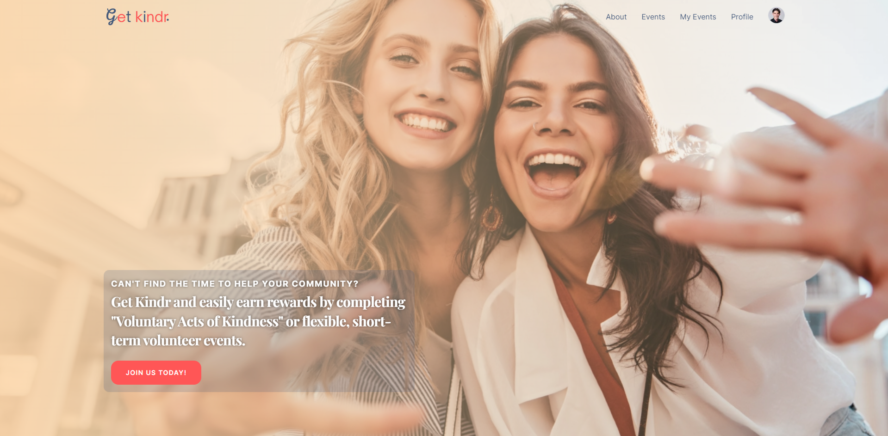
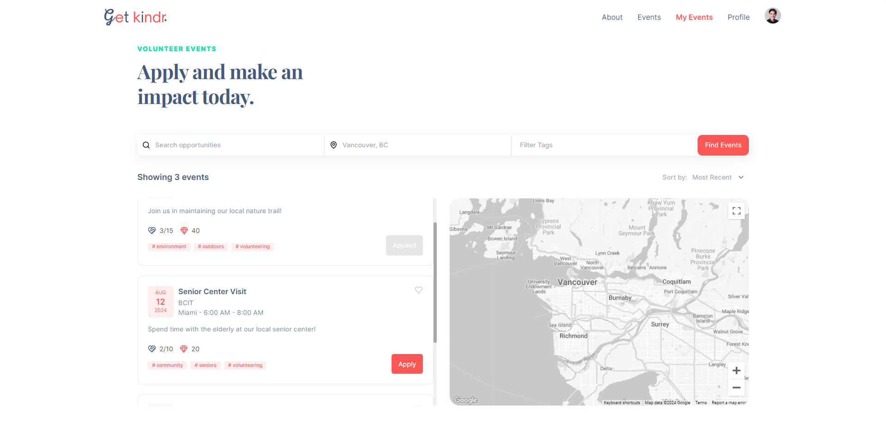
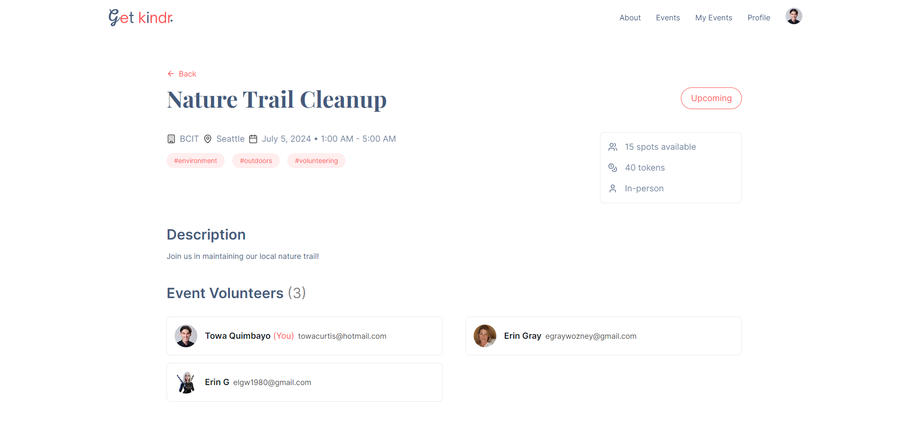
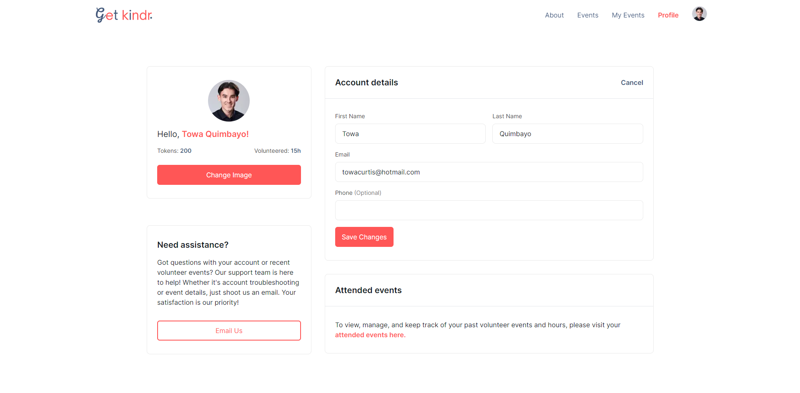
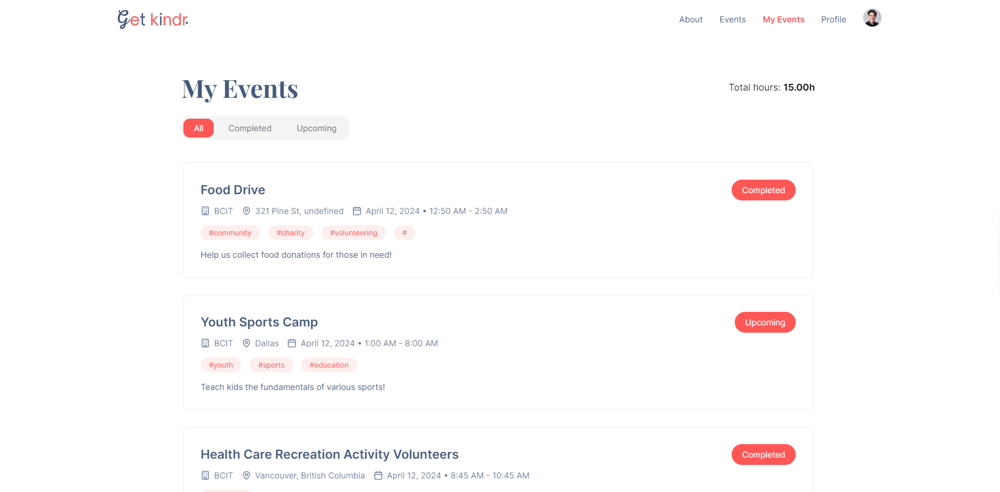

# Get Kindr

A gamified web application that connects volunteers seeking opportunities and organizations hosting events by allowing volunteers to apply for available events and organizations to create new volunteer opportunities.

_Check out the live project [_here_](https://getkindr.com/)._

## Table of Contents

* [Screenshots](#screenshots)
* [Acknowledgements](#acknowledgements)
* [Technologies](#technologies)
* [Usage](#usage)
  * [Prerequisites](#prerequisites)
  * [Installation](#installation)
  * [Environment Variables Setup](#environment-variables-setup)
  * [Run The App](#run-the-app)
* [Features](#features)
  * [User Authentication](#user-authentication)
  * [Event Management](#event-management)
  * [Token System](#token-system)

## Screenshots

|  |  |
|:--:|:--:|
| _Login Page_ | _Home Page_ |
|  |  |
| _Events Page_ | _Event Page_ |
|  |  |
| _Profile Page_ | _My Events Page_ |

## Acknowledgements

* Towa Quimbayo [GitHub](https://github.com/towaquimbayo) [LinkedIn](https://www.linkedin.com/in/towa-quimbayo/)
* Noufil Saqib [GitHub](https://github.com/noufilsaqib) [LinkedIn](https://www.linkedin.com/in/muhammad-noufil-saqib/)
* Juan Escalada [GitHub](https://github.com/jescalada) [LinkedIn](https://www.linkedin.com/in/jescalada/)
* Maximillian Yong [GitHub](https://github.com/MaximillianYong) [LinkedIn](https://www.linkedin.com/in/maximillianyong)
* Braden Rogers [GitHub](https://github.com/BRogers-BCIT) [LinkedIn](https://www.linkedin.com/in/braden-rogers-591128305/)

[](https://github.com/towaquimbayo/Get-Kindr/graphs/contributors)

## Technologies

* Next.js `v13.5.5`
* TypeScript `v5.2.2`
* React.js `v18.2.0`
* TailwindCSS `v3.3.3`
* PostgreSQL
* Prisma `v4.16.2`
* Vercel
* JWT Authentication (Next-Auth) `v4.24.7`
* Google Maps API `v134.0.0`
* Mapbox API `3.2.0`
* Nodemailer `v6.9.12`
* Next UI `v2.0.15`

## Usage

<details>
  <summary>Prerequisites</summary>

### Prerequisites

* [VSCode](https://code.visualstudio.com/download/)
* [Git](https://git-scm.com/downloads/)
* [Node.js](https://nodejs.org/en/download/)

</details>

<details>
  <summary>Installation</summary>

### Installation

1. Install latest npm package version.

  ```sh
  npm install npm@latest -g
  ```

2. Clone the repository to local machine.

  ```sh
  git clone https://github.com/towaquimbayo/Get-Kindr.git
  ```

3. Installing required dependencies requires Node and npm.

  ```sh
  npm i --legacy-peer-deps
  ```

</details>

<details>
  <summary>Environment Variables Setup</summary>

### Environment Variables Setup

For the project to run correctly, environment variables are required. Rename the `.env.example` to `.env`.

1. Create a free PostgreSQL database at <https://vercel.com/postgres/> and fill in your PostgreSQL account details.
2. Create a Google OAuth app at <https://refine.dev/blog/nextauth-google-github-authentication-nextjs/#for-googleprovider-make-sure-you-have-a-google-account/>
3. Create a free ImgBB account to obtain ImgBB API key at <https://api.imgbb.com/>
4. Create a free Mapbox account to obtain Mapbox access token at <https://docs.mapbox.com/help/tutorials/get-started-tokens-api/>
5. Create a free Google Cloud Console account to obtain Google Maps API key at <https://developers.google.com/maps/documentation/javascript/get-api-key/>

</details>

<details>
  <summary>Run The App</summary>

### Run The App

Running the application locally or in production is straightforward since both the frontend and backend are integrated into a single Next.js application running on port 3000.

* Execute `npm run build` to build the application for production.
* Execute `npm run dev` to run locally in development mode or `npm start` to run it using the production build.

__Note:__ This process will also build the Prisma schema for your PostgreSQL database if you haven't defined it already. Depending on your PostgreSQL setup, you may need to execute `npx prisma db push` to push the schema to your database.
__Note:__ Any changes to the `schema.prisma` file will automatically update the database schema during these steps.

</details>

## Features

### User Authentication

Our application ensures robust and secure user authentication and session management using JSON Web Tokens (JWT) via Next-Auth. This setup leverages HttpOnly cookies to protect specific API routes, ensuring that only authorized users can access sensitive information.

* __Forgot Password__: Users can securely reset their passwords through a secure One-Time Password (OTP) token process.
* __Profile Management__: Users can create and update their profiles, including changing their username, email, password, phone number, and profile picture, ensuring a personalized and secure experience.

### Event Management

Our event management system empowers organizations to create, manage, and track their hosted events, including past events. Volunteers can apply and attend these events, and track their participation history and volunteer hours.

* __Event Details__: Each event includes detailed information such as location, date, time, tags, available seats, token rewards, and a description, along with a list of volunteer applicants.
* __Event Applications__: Volunteers can easily browse and apply to events that match their interests and skills.
* __Event Searching, Filtering, and Sorting__: Users can filter events by name, tags, and location. Additionally, events can be sorted by the number of tokens and date, and volunteers can utilize a search tab to find specific events.
* __Interactive Maps Integration__: Event locations are displayed on an interactive map using the Google Maps API and Mapbox GL, providing a visual and navigable interface.
* __Event Completion__: Organizations have the authority to close or complete events after their date has passed, rewarding volunteers with tokens for their participation.

### Token System

Our token system is designed to incentivize and reward volunteers for their participation in events.

* __Reward Tokens__: Organizations can grant tokens to volunteers upon the completion of their volunteer hours, marking the event as complete.
* __Manage Tokens__: Volunteers can manage their earned tokens within their accounts. While the functionality for redeeming tokens for rewards is yet to be implemented, this feature sets the groundwork for a future system where volunteers can exchange tokens for tangible prizes.
